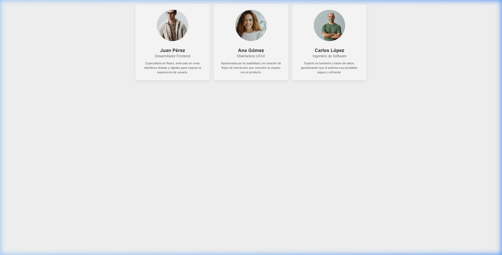

# Mi tarjeta de presentación en React

## Descripción y objetivos
Resolución de la Unidad 4 del módulo de React Inicial. 
Los objetivos principales de esta práctica son:
- Creación de componentes funcionales.
- Uso de JSX.
- Paso de props para personalizar contenido.

## Instrucciones de instalación y ejecución
1. Clonar el repositorio en tu máquina local o descargar los archivos.
2. Abrir una terminal en la carpeta raíz del proyecto.
3. Instalar las dependencias ejecutando el comando `npm install`.
4. Ejecutar el entorno de desarrollo con el comando `npm run dev`.
5. Abrir el navegador en la URL que indique la consola.

## Capturas de pantalla

## Autor
Santiago Sessa - Curso 181751 - Módulo 1 (Unidad 4).

